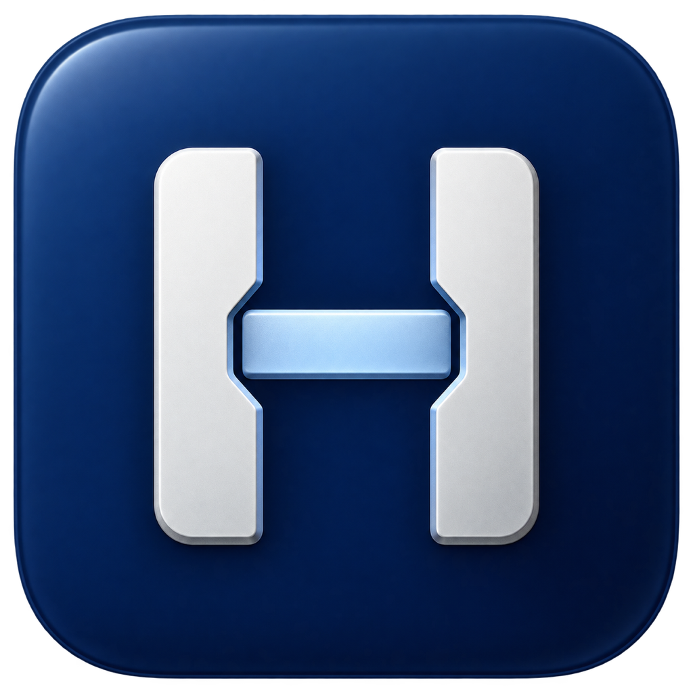
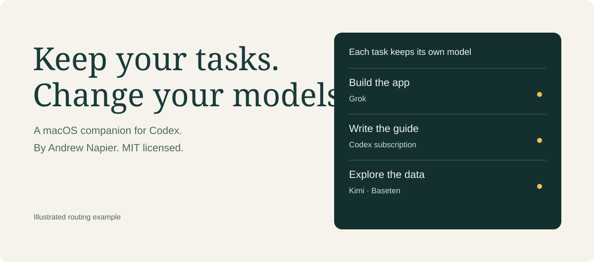

<p align="center"></p>
<h1 align="center">Model Harbor</h1>
<p align="center"><strong>Keep your tasks. Change your models.</strong></p>
<p align="center">A native macOS companion for Codex, maintained by Andrew Napier.</p>
<p align="center"><a href="https://napiermd.github.io/model-harbor/">Website & interactive demo</a> · <a href="docs/getting-started.md">Get started</a> · <a href="docs/architecture.md">How it works</a> · <a href="CONTRIBUTING.md">Contribute</a></p>
<p align="center"><a href="LICENSE"></a>  <a href="https://github.com/napiermd/model-harbor/actions/workflows/ci.yml"></a></p>

Model Harbor connects your Codex subscription, Grok sign-in, Azure OpenAI, Baseten, and optional OpenRouter account to Codex. Choose a model in each task, track account usage and API spend, and keep the bridge available in the Dock or menu bar.

> **Source preview.** Build locally with Xcode. A notarized public installer is not available yet. Load Harbor's catalog with one Codex restart, then switch among loaded models within existing Harbor tasks. See [setup and compatibility](docs/getting-started.md).



## What you can do

| Capability | How it works |
| --- | --- |
| Keep a different model in each task | Choose a named model in the Codex task picker. Other tasks keep their choices. |
| See usage and spend | Read Codex and Grok quotas and resets, Baseten organization costs, and OpenRouter key spend. Sources and account scope stay visible. |
| Use the Dock and menu bar | Keep both, or choose menu bar only. Closing the window keeps Harbor serving tasks. |
| Customize the menu bar | Show connection, activity, remaining quota, today's spend, next reset, last requested model, or a compact icon. |
| Control startup and warm-up | Launch at login, choose appearance, and optionally schedule a short Codex request. Warm-up is off by default and uses quota. |
| Run a mixed-model coding team | Pin planning, coding, and review models with the bundled worktree launcher. |

See [what changed](CHANGELOG.md) and the [roadmap](ROADMAP.md).

## Build and connect

Install macOS 13+, Xcode 16+, and Homebrew Python 3.14. Open Codex and sign in once so its local configuration and model catalog exist.

```sh
git clone https://github.com/napiermd/model-harbor.git
cd model-harbor
./scripts/build-app.sh --ad-hoc
open "build/Build/Products/Debug/Model Harbor.app"
```

This creates a local evaluation app. For ongoing use with saved accounts, use a **stable signing certificate**. Ad-hoc rebuilds can prompt for Keychain approval again. The build script can reuse the identity of an installed Model Harbor app, or you can set `MODEL_HARBOR_SIGNING_IDENTITY`. It does not install over an existing app or change signing certificates.

Follow the [setup guide](docs/getting-started.md) to connect providers, choose a new-task default, and load the Codex picker. The source preview prepares a retained background gateway. Existing installations need the [coordinated migration](docs/runtime-service.md) before GUI quit can preserve inference.

## Bring your connections

| Connection | Authentication | Behavior |
| --- | --- | --- |
| Current Codex subscription | ChatGPT sign-in managed by Codex | Uses the current account and its available model catalog. |
| Grok | Official Grok CLI browser OAuth | Uses the official client's session, refresh flow, and account models. |
| Azure OpenAI | API key in macOS Keychain | Tests your named deployment with the Responses API, then routes directly to your Azure resource. |
| Baseten | Direct API credential or credential helper | Calls Baseten directly. A helper such as 1Password unlocks once per Harbor session. |
| OpenRouter | API key in macOS Keychain | Verifies your key, discovers tool-capable models, and uses your OpenRouter account. |
| Saved Codex accounts | Browser OAuth and macOS Keychain | Provides a separate direct-account switching workflow that requires restarting Codex. |

Provider access, available models, and charges depend on your accounts. Grok OAuth does not guarantee that every subscription includes CLI access. Harbor supplies no provider credits. OpenRouter is optional and has its own billing.

Use **Add provider → Azure** to add your resource endpoint, key, and deployment name; see [Azure setup](docs/azure.md). Use **Settings → Models** to choose exactly which models appear in Codex, or hide all Baseten models while retaining the connection. **Settings → Providers** separately controls Harbor tabs. Azure billing and quota are currently viewed in the Azure dashboard.

Use **Add provider → OpenRouter** for the verified-key setup. The **Custom provider** editor supports compatible direct Responses endpoints. Adding another provider to live Harbor routing requires implementation and compatibility checks. See [customization](docs/customization.md).

## Change models in the same conversation

Choose a model in **each Codex task's picker**. Task A can use Grok while task B keeps its Codex model. An in-progress turn finishes with the model it started with. Harbor's **new-task default** affects future tasks.

New catalog entries require reopening Codex once. Switching among entries already loaded in a Harbor task does not. Provider account sign-ins are shared connections; Harbor does not isolate a different OAuth identity for every task.

An older task created with the native OpenAI provider may report that a `harbor/...` model is unsupported. [Automatic route repair](docs/getting-started.md#repair-an-older-openai-task) can migrate the task after Codex releases its writer lock and preserve the conversation. Codex can stay open when archive and restore release that task; an offline repair is also available.

## Dock, menu bar, and settings

The provider panel shows connection readiness, active requests, and completed responses. Codex shows **Configured** until Harbor verifies a completed response. An expired readiness check shows that another connection check is needed while preserving access to saved connection settings. The panel grows to fit its content and scrolls when it reaches the available screen height.

| Settings section | Controls |
| --- | --- |
| **General** | Dock/menu-bar presence, close behavior, manual-launch window, launch at login, System/Light/Dark appearance, and optional warm-up. |
| **Menu bar** | Display mode, icon visibility, usage refresh, and optional CodexBar history. |
| **Models** | Codex picker shortlist, provider and individual model visibility, Azure deployment discovery, and new-task default. |
| **Providers** | Harbor tab visibility, connections, and saved Codex accounts. |
| **Advanced** | Inactive-task route repair and confirmed Codex close/reopen actions. |

Closing Harbor's window keeps the bridge running. The close dialog offers **Keep in Dock**, **Menu Bar Only**, **Cancel**, and **Remember this choice**. **Quit Harbor** disconnects the UI from the new independent gateway; older GUI-owned gateways still require Harbor to remain open. Reopening the interface attaches to the existing gateway without resending credentials or changing its configuration. A newer bundled gateway remains pending until a coordinated update. See [runtime ownership and migration limits](docs/runtime-service.md). Launch at login uses macOS login-item registration and opens quietly.

Warm-up sends one short, low-effort request through the current Codex account. Choose manual, after-startup, or daily operation and edit the prompt. Automatic attempts run only while Harbor is ready and idle, at most once per local day. Warm-up consumes subscription quota, does not raise rate limits, and makes no performance guarantee. See [lifecycle and startup](docs/lifecycle.md).

## Understand usage and spend

Open **Usage & spend** to view account limits, reset times, and API costs. Baseten costs cover the entire organization across Model API keys. OpenRouter figures cover the current key. Reading a different account's usage does not switch a task's model or credentials.

CodexBar is an optional source for cached Claude quota and local token-value history. Those API-price estimates are labeled separately from provider-reported charges and are not subscription bills. Usage checks reuse existing credentials without opening 1Password. See [coverage, sources, and setup](docs/USAGE.md).

## Mixed-model coding teams

The bundled launcher uses Kimi K3 for planning and review, with GLM 5.3, DeepSeek V4 Pro 0813, and Kimi K2.7 Code in separate coding worktrees. Roles pin their model and verified reasoning setting. The coordinating task reviews and integrates the results. Codex can stay open.

See [agent teams](docs/agent-teams.md) for role installation, assignments, concurrent workers, and the difference between native subagents and isolated worktrees.

## Read, change, verify

The app is SwiftUI. The local Responses bridge is Python with no Python package dependencies. The website is plain HTML, CSS, and JavaScript. No Model Harbor cloud service sits in the request path.

- [Architecture](docs/architecture.md): request destinations, credential boundaries, and source files.
- [Safe updates](docs/safe-updates.md): stage a verified build while preserving the running gateway; [audit and implementation plan](docs/update-safety-audit.md).
- [Independent runtime](docs/runtime-service.md): ownership, credential handoff, and migration limits; [desktop lifecycle evidence](docs/desktop-lifecycle-evidence.md).
- [Azure history verification](docs/verification/azure-history.md): reasoning preservation, tool continuity, and the remaining real-provider check.
- [Azure request policy](docs/azure-request-policy.md): total deadlines, cancellation, no automatic replay, and verified caller retry settings.
- [Bifrost evaluation](docs/bifrost-evaluation.md): isolated pilot and adoption gates.
- [Customization](docs/customization.md): model catalogs, providers, interface, and build configuration.
- [Verification](FORK.md): automated coverage, live checks, and known limits.
- [Contributing](CONTRIBUTING.md): local development and pull requests.
- [Security](SECURITY.md): private reporting and credential handling.

```sh
swift test
python3 -m unittest discover -s Tests -p 'test_*.py'
python3 scripts/check-site.py
```

Live verification is opt-in, uses your provider accounts, and may consume quota or incur API charges. Public CI uses synthetic fixtures. Login after a real reboot and live warm-up still need separate verification.

## Ownership and license

Model Harbor is **Andrew Napier's** community fork of [CodexModelSwitcher](https://github.com/hieunc229/CodexModelSwitcher), created by **Hieu Nguyen (Jack)**. The upstream authorship and Git history remain credited. Harbor adds task routing, usage tracking, authentication protections, tests, its own visual identity, and documentation.

[MIT licensed](LICENSE). Use, modify, fork, and redistribute it under that license. See [NOTICE.md](NOTICE.md) for provenance, font licenses, and third-party names. Model Harbor is independent of OpenAI, xAI, Baseten, OpenRouter, 1Password, and CodexBar.
