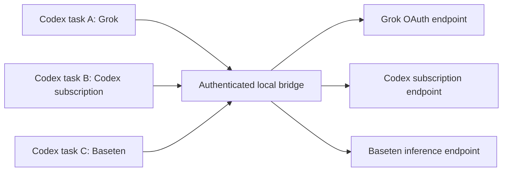

# How Model Harbor works

[← Model Harbor](../README.md)

Model Harbor runs on your Mac. The SwiftUI app manages connections and the Python bridge forwards requests to the selected provider. Codex owns the conversation, task persistence, and model picker.

## Selection belongs to the task

Each model has an explicit route ID, such as `harbor/grok-oauth/<model>` or `harbor/baseten/<model>`. `LiveRouting.swift` builds the catalog. The bridge validates the requested route against configured models. It does not look at the app's default to decide which model an existing task uses.

Codex also persists the task's provider. A model-picker change does not migrate that provider. An older `openai` task paired with a `harbor/...` model therefore sends the Harbor model name to the native OpenAI connection and fails before reaching Harbor. See the [offline task repair](getting-started.md#repair-an-older-openai-task) for that case.

Codex persists the model choice for each task. A `(thread_id, turn_id)` pair pins tool continuations to the route that began the turn. Changing the model affects a subsequent turn. A hidden legacy route remains fixed to its pre-upgrade model for older tasks.

The **New task default** updates configuration for future tasks. Accounts remain shared connections; this does not isolate a separate OAuth identity for every task.

## Credentials and request destinations

| Credential | Owner / storage | Sent to |
| --- | --- | --- |
| Current Codex subscription | Codex's own authentication and refresh flow | `https://chatgpt.com/backend-api/codex` only |
| Grok OAuth | Official Grok CLI session store and refresh flow | `https://cli-chat-proxy.grok.com/v1` only |
| Baseten API credential | Existing helper or environment; helper output cached only in process memory | `https://inference.baseten.co/v1` only |
| Saved Codex accounts | macOS Keychain, under `dev.napier.ModelHarbor` | The separate Codex account workflow |
| Local bridge token | Owner-only local file/config header | The loopback bridge only |

The bridge listens on `127.0.0.1:48118`. Requests require the local token. It rejects browser-origin requests and upstream redirects. Subscription credentials are not sent to Grok or Baseten. Auth failures do not fall back to a separately billed API route.

**Conversation content goes to the provider selected for that turn.** When you switch providers within a task, the replayed conversation and tool results may be sent to the new provider. The local bridge is not a promise that model inference stays on your Mac. Review your provider's data terms before using private material.

Harbor does not log prompts, request headers, or tokens. Its protected status endpoint reports the latest forwarded route and credential-cache state. This is operational status, not a per-task conversation log or proof of a model's underlying weights.

## Tools and history

Codex subscription requests retain native namespaces and custom tools. Grok and Baseten use a translation layer for tool definitions, calls, results, and streaming. Replayed history keeps tool-call links while removing provider-owned item IDs and opaque reasoning that cannot safely move between providers. Requests requiring opaque `previous_response_id` state fail instead of silently losing context.

Protocol compatibility can change. The current checks exercise synthetic tool calls and remembered conversation content; they do not prove every tool or modality works with every provider.

## Local files

Harbor preserves several historical filenames so upgrades retain user data:

- `~/.codex/model-switcher.json`: connection metadata, with credentials excluded by the encoder.
- `~/.codex/config.toml`: the active Codex settings, updated with locking, validation, private backups, and atomic replacement.
- `~/.codex/model-catalogs/model-harbor.json`: generated route catalog.
- `~/.codex/model-harbor-bridge-token`: private local bridge authentication.

Treat the entire Codex directory as private. Metadata can still contain account names or emails even when tokens are excluded. Other configuration managers do not share Harbor's lock.

## Source map

| File | Responsibility |
| --- | --- |
| `ModelHarbor/ContentView.swift` | Native connections and settings UI |
| `ModelHarbor/AppStore.swift` | Connection state, catalog discovery, saved settings |
| `ModelHarbor/LiveRouting.swift` | Per-model route IDs and catalog generation |
| `ModelHarbor/CodexConfigWriter.swift` | Validated config updates and backups |
| `ModelHarbor/CredentialStore.swift` | Keychain boundary and metadata encoding |
| `ModelHarbor/GrokAdapter.swift` | Bridge process lifecycle and official Grok login |
| `ModelHarbor/Support/grok_adapter.py` | Provider routing, auth boundaries, translation, streaming |
| `Tests/` | Local checks without real accounts |
| `scripts/verify-live-switch.py` | Explicit live verification with synthetic tasks |
| `site/` | Public GitHub Pages site |
