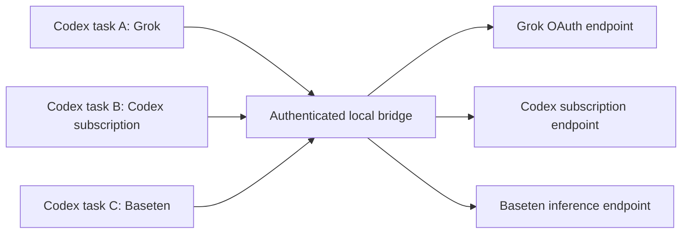

# How Model Harbor works

[← Model Harbor](../README.md)

Model Harbor runs on your Mac. The SwiftUI app manages connections and the Python bridge forwards requests to the selected provider. Codex owns the conversation, task persistence, and model picker.

## Selection belongs to the task

Each model has an explicit route ID, such as `harbor/grok-oauth/<model>` or `harbor/baseten/<model>`. `LiveRouting.swift` builds the catalog. The bridge validates the requested route against configured models. It does not look at the app's default to decide which model an existing task uses.

Codex also persists the task's provider. A model-picker change does not migrate that provider. An older `openai` task paired with a `harbor/...` model therefore sends the Harbor model name to the native OpenAI connection and fails before reaching Harbor. See the [task route repair](getting-started.md#repair-an-older-openai-task) for that case.

Codex persists the model choice for each task. A `(thread_id, turn_id)` pair pins tool continuations to the route that began the turn. Changing the model affects a subsequent turn. A hidden legacy route remains fixed to its pre-upgrade model for older tasks.

The **New task default** updates configuration for future tasks. Accounts remain shared connections; this does not isolate a separate OAuth identity for every task.

## Repairing saved routes

`Support/task_repair.py` is the shared engine for the app and command-line repair. Monitoring is read-only until the user enables automatic repair. Each pass finds OpenAI tasks with an installed Harbor selection; it does not change native models or other providers.

For a live-app repair, the engine takes Codex's `thread-writer-locks/.coordination.lock`, opens and exclusively locks the selected task's lock file, then releases coordination. It holds the task lock through validation, backup, file publication and SQLite commit. Codex's active writer or publication lock causes repair to wait. The engine never deletes the shared lock file and never stops a task. Missing lock support requires the offline command instead.

The backup journal records original and replacement file hashes plus the conversation-body hash. A crash between replacing the rollout and committing SQLite leaves a prepared journal. Recovery takes the same task lock and finishes only an exact original/replacement state; subsequent conversation changes stop recovery. Reports and backups are private local files. Repair settings use the existing authenticated loopback API and reject browser-origin requests.

The end-to-end check reproduces a native-provider failure, verifies refusal while Codex owns the task lock, archives the task, repairs it, then restores and completes the same task through Harbor in the same Codex process. All verification traffic uses synthetic data and loopback model endpoints.

## Credentials and request destinations

| Credential | Owner / storage | Sent to |
| --- | --- | --- |
| Current Codex subscription | Codex's own authentication and refresh flow | `https://chatgpt.com/backend-api/codex` only |
| Grok OAuth | Official Grok CLI session store and refresh flow | `https://cli-chat-proxy.grok.com/v1` only |
| Baseten API credential | Existing helper or environment; helper output cached only in process memory | `https://inference.baseten.co/v1` only |
| Saved Codex accounts | macOS Keychain, under `dev.napier.ModelHarbor` | The separate Codex account workflow |
| Local bridge token | Owner-only local file/config header | The loopback bridge only |

The bridge listens on `127.0.0.1:48118`. Requests require the local token. It rejects browser-origin requests and upstream redirects. Subscription credentials are not sent to Grok or Baseten. Auth failures do not fall back to a separately billed API route.

**Conversation content goes to the provider selected for that turn.** When you switch providers within a task, the replayed conversation and tool results may be sent to the new provider. The local bridge is not a promise that model inference stays on your Mac. Review your provider's data terms before using private material.

Harbor does not log prompts, request headers, or tokens. Its protected status endpoint reports the latest forwarded route and credential-cache state. This is operational status, not a per-task conversation log or proof of a model's underlying weights.

## Baseten pacing and overload recovery

All tasks using the same Baseten model share a FIFO queue in the running bridge. A model has one upstream request in flight at a time; other models and providers have independent lanes. This accounts for tool continuations and simultaneous tasks using the same allowance.

The bridge starts conservatively at 500,000 tokens and 120 requests per minute. Baseten's response headers replace those defaults with the account's effective limits. Before dispatch, Harbor reserves a conservative estimate of input, tool definitions, and output. On completion it reconciles that reservation with actual input and output usage, including cached input. It also respects the remaining capacity reported by Baseten. Estimates are not exact tokenization, and traffic from other clients can still consume the account's allowance.

An HTTP 429 or 529 rejection gets up to three retries. Delays start at 10 seconds, double to a 60-second base, and add up to 20% jitter. A longer `Retry-After` takes precedence, including HTTP-date values. Cooldowns remain shared when Codex retries the request or another task uses the model. Each request has a 120-second queue/retry budget, checked between upstream attempts; an individual network operation retains its 180-second timeout. Long cooldowns are returned to Codex rather than retried early. The bridge preserves structured provider errors, rate-limit headers, request IDs, and the remaining retry delay.

Retries use the same cached credential. Authentication failures, ambiguous network failures, and responses that have already started streaming are never automatically replayed. A disconnected client is removed from the queue or backoff wait before another request is sent. The protected status endpoint includes per-model limits, queue size, cooldown, and request/retry counters without credentials or conversation content. Queue and cooldown state live in memory until Harbor quits.

Pacing cannot create provider capacity or raise an account limit. Persistent 529s may still end the turn. See [Baseten's rate-limit documentation](https://docs.baseten.co/inference/model-apis/pricing-and-limits).

## Tools and history

Codex subscription requests retain native namespaces and custom tools. Grok and Baseten use a translation layer for tool definitions, calls, results, and streaming. Replayed history keeps tool-call links while removing provider-owned item IDs and opaque reasoning that cannot safely move between providers. Requests requiring opaque `previous_response_id` state fail instead of silently losing context.

Protocol compatibility can change. The current checks exercise synthetic tool calls and remembered conversation content; they do not prove every tool or modality works with every provider.

## Local files

Harbor preserves several historical filenames so upgrades retain user data:

- `~/.codex/model-switcher.json`: connection metadata, with credentials excluded by the encoder.
- `~/.codex/config.toml`: the active Codex settings, updated with locking, validation, private backups, and atomic replacement.
- `~/.codex/model-catalogs/model-harbor.json`: generated route catalog.
- `~/.codex/model-harbor-bridge-token`: private local bridge authentication.

Treat the entire Codex directory as private. Metadata can still contain account names or emails even when tokens are excluded. Other configuration managers do not share Harbor's lock.

## Source map

| File | Responsibility |
| --- | --- |
| `ModelHarbor/ContentView.swift` | Native connections and settings UI |
| `ModelHarbor/AppStore.swift` | Connection state, catalog discovery, saved settings |
| `ModelHarbor/LiveRouting.swift` | Per-model route IDs and catalog generation |
| `ModelHarbor/CodexConfigWriter.swift` | Validated config updates and backups |
| `ModelHarbor/CredentialStore.swift` | Keychain boundary and metadata encoding |
| `ModelHarbor/GrokAdapter.swift` | Bridge process lifecycle and official Grok login |
| `ModelHarbor/Support/grok_adapter.py` | Provider routing, auth boundaries, translation, streaming |
| `Tests/` | Local checks without real accounts |
| `scripts/verify-live-switch.py` | Explicit live verification with synthetic tasks |
| `site/` | Public GitHub Pages site |

## Provider inspection and OpenRouter

`ProviderPresentation.swift` defines the provider registry, menu-bar modes, activity parsing, and tool-capable OpenRouter catalog conversion. The app polls the owner-authenticated local status endpoint every two seconds. Polling never invokes 1Password. Request counters are session-local and track concurrent work independently by provider.

OpenRouter setup validates a key with `GET https://openrouter.ai/api/v1/key` and fetches `GET /models`. The app stores that key in Keychain and sends its working copy only to the owner-authenticated loopback configuration endpoint. The bridge routes explicit `harbor/openrouter/<model>` requests to `https://openrouter.ai/api/v1/responses`, using only the OpenRouter credential. It rejects unknown model IDs. Upstream authentication failures clear the in-memory credential. Disconnect removes the saved key and keeps catalog choices for reconnecting.

The public model catalog declares tools, reasoning, input modalities, and context capacity. These declarations determine available choices; they do not substitute for model-specific live verification. OpenRouter's official Responses schema is maintained in [its TypeScript SDK](https://github.com/OpenRouterTeam/typescript-sdk/blob/main/src/models/responsesrequest.ts).
